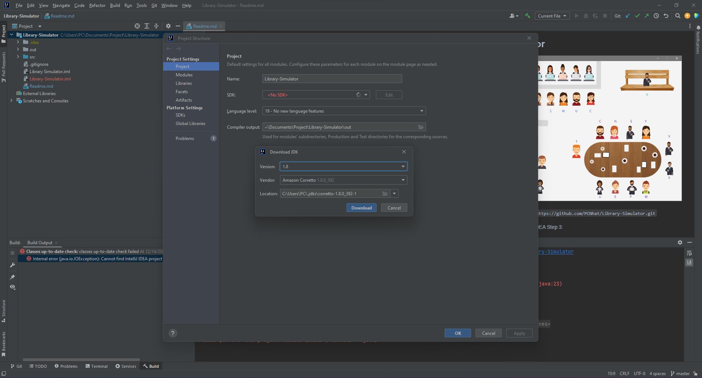

## The Library Simulator 

Step 1: Clone this project
`git clone https://github.com/PCNhat/Library-Simulator.git`

Step 2: Open this project with IntelliJ IDEA

Step 3: Goto File -> Project Structure ->  Project Settings -> Project

Download SDK: 
- Version: 1.8 
- Vendor: AmazonCorretto

Select Language level: 8 - Lambdas, type annotations etc.

Click to Apply button and then click to Ok button

Step 4: Press Ctrl + F9 to build project

Step 5: Run file src/com/librarysimulator/Application/Main.java

